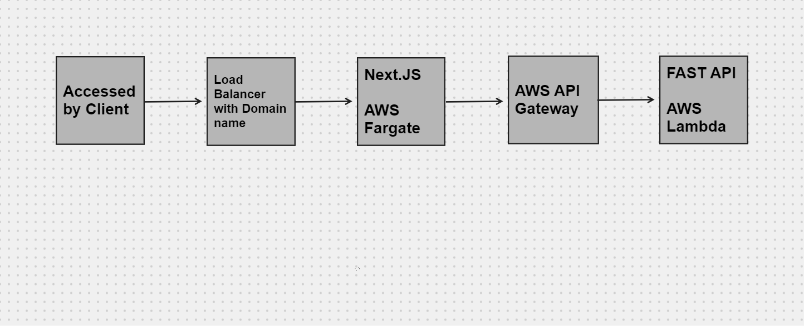
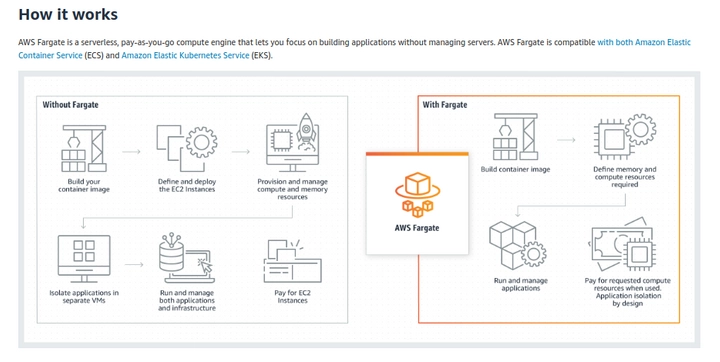
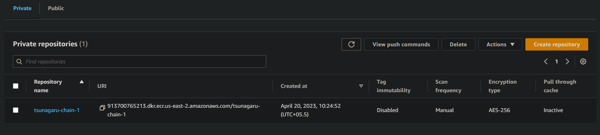
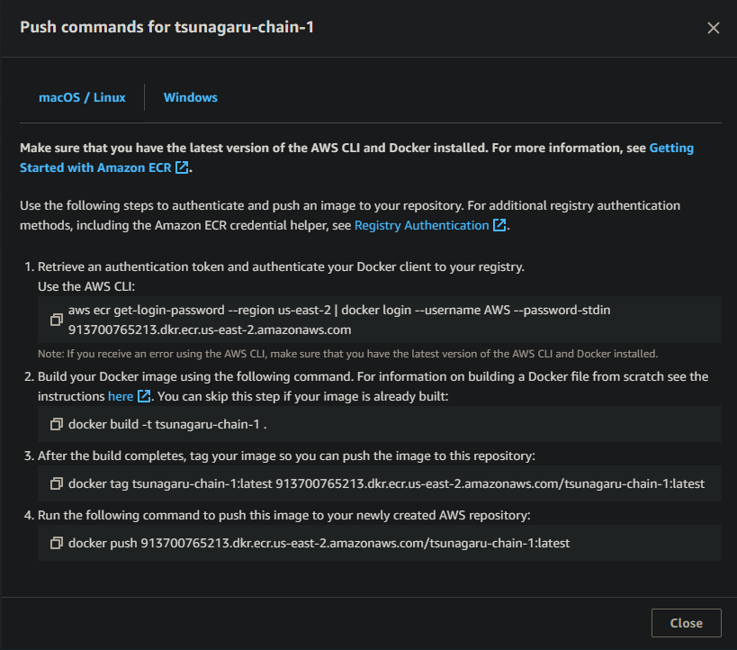
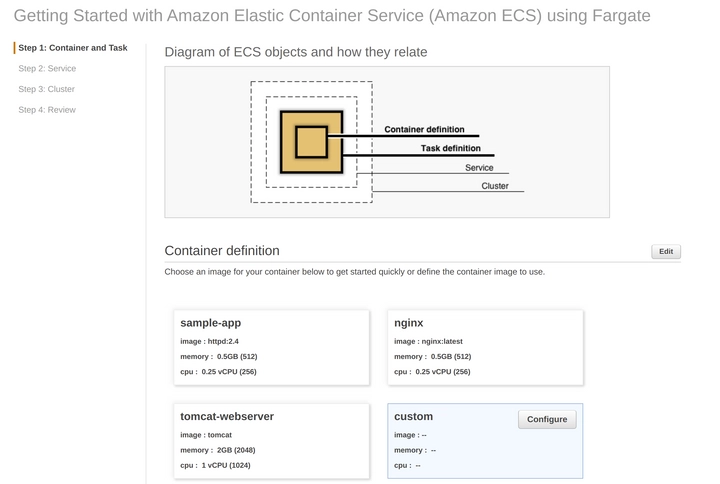
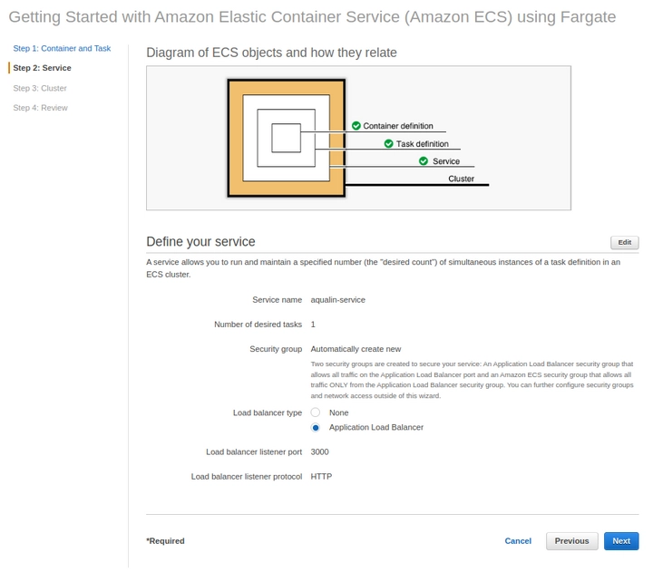

### Structure

## Frontend
- We create a Docker image for our Next.JS app
- Using Aws Fargate 

#### Setting up AWS Fargate
- We create a container repository in AWS ECR (Elastic Container Repository)
- Creating a private repository for all the docker images
- Pushing the Docker image we built to the above created repo

- We go back to the ECS Clusters page and click on **Get started** to actually use AWS Fargate.
- On the **Container and Task** page, we  **Configure** a **Custom** container definition and add previous image URL
- In **Service** page we add an application load balancer(we can add a custom domain url to the load balancer later)

#### set up continuous delivery pipelines in our code repository on GitHub, using **Github Actions**
- In our GitHub repository, we click on the **Action** tab and configure a new workflow using **Deploy to Amazon ECS**. This will create an aws.yml file with explanations about how to use it.
- Each time we push on main in our project, this workflow runs and deploys our application with AWS Fargate.

## Backend
- Create a Lambda function with Python (with magnum.io - useful for wrapping all fastAPI code for AWS Lambda)
- Create API Gateway for sending data requests to the backend 
- Deploy API 
- Upload fastAPI code as .zip to Lambda function
- [Deploy a FastAPI app in AWS Lambda - Guillaume Martin (guillaume-martin.github.io)](https://guillaume-martin.github.io/deploy-fastapi-on-aws-lambda.html) - use this api exposed here in the nextjs app
- [Mangum](https://mangum.io/) - to make fastapi work on lambda
- [Serverless](serverless.com) - deploy the code